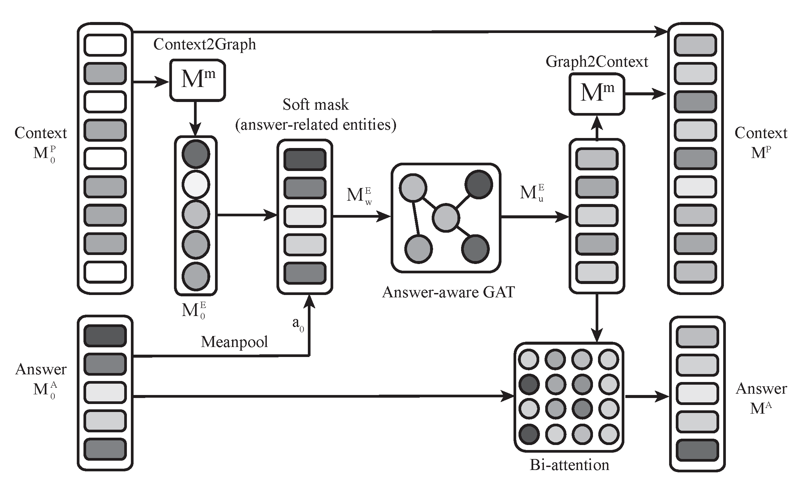

# KGEL
Multi-hop Question Generation with Knowledge Graph-enhanced Language Model

this is main part of the code, i update the whole program to baiduyun:

url：https://pan.baidu.com/s/1RYcjrawaZZdIPW7pK44DDQ 

get code：qjyq 

the main framework is in GPT2LMHeadModel.py in model file, at line 1057, the code is worse now , i will Revise a complete version before 2022.5.1

for sorry, recently i am busy in paper writing and graduation of doctor.

anybody need detatils fo this paper can call or add wechat by :

18683372961
or 

email:
li_zhenping@126.com

cite：

If you use any source codes or datasets included in this toolkit in your work, please cite the following paper. The bibtex is listed below:
<pre>
@Article{app13095765,
AUTHOR = {Li, Zhenping and Cao, Zhen and Li, Pengfei and Zhong, Yong and Li, Shaobo},
TITLE = {Multi-Hop Question Generation with Knowledge Graph-Enhanced Language Model},
JOURNAL = {Applied Sciences},
VOLUME = {13},
YEAR = {2023},
NUMBER = {9},
ARTICLE-NUMBER = {5765},
URL = {https://www.mdpi.com/2076-3417/13/9/5765},
ISSN = {2076-3417},
DOI = {10.3390/app13095765}
}
<pre>

## Abstract

The task of multi-hop question generation (QG) seeks to generate questions that require a complex reasoning process that spans multiple sentences and answers. Beyond the conventional challenges of what to ask and how to ask, multi-hop QG necessitates sophisticated reasoning from dispersed evidence across multiple sentences. To address these challenges, a knowledge graph-enhanced language model (KGEL) has been developed to imitate human reasoning for multi-hop questions.The initial step in KGEL involves encoding the input sentence with a pre-trained GPT-2 language model to obtain a comprehensive semantic context representation. Next, a knowledge graph is constructed using the entities identified within the context. The critical information in the graph that is related to the answer is then utilized to update the context representations through an answer-aware graph attention network (GAT). Finally, the multi-head attention generation module (MHAG) is performed over the updated latent representations of the context to generate coherent questions. Human evaluations demonstrate that KGEL generates more logical and fluent multi-hop questions compared to GPT-2. Furthermore, KGEL outperforms five prominent baselines in automatic evaluations, with a BLEU-4 score that is 27% higher than that of GPT-2.

## MulQG Framework:

Framework of KGEL. It consists of three major modules: a context understanding module, a reasoning module, and a generation module.

The illustration of the reasoning module. We implement a dynamic procedure of Context2Graph and Graph2Context using a mapping matrix M. The entity representation is updated using an answer-aware GAT, and the answer representation is updated through a bi-attention mechanism.

